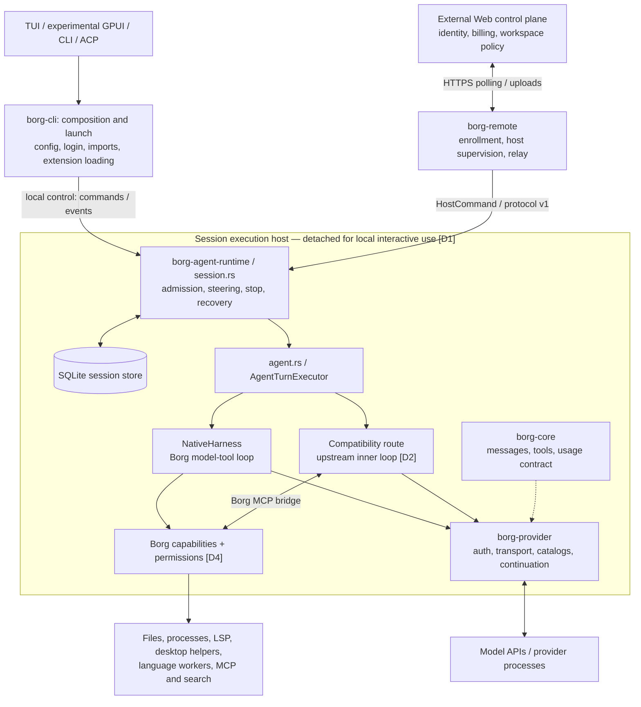
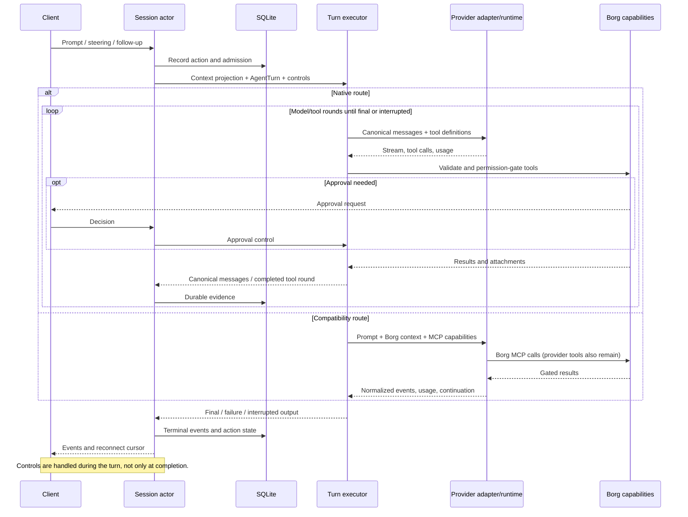
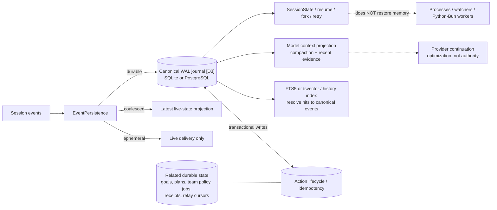
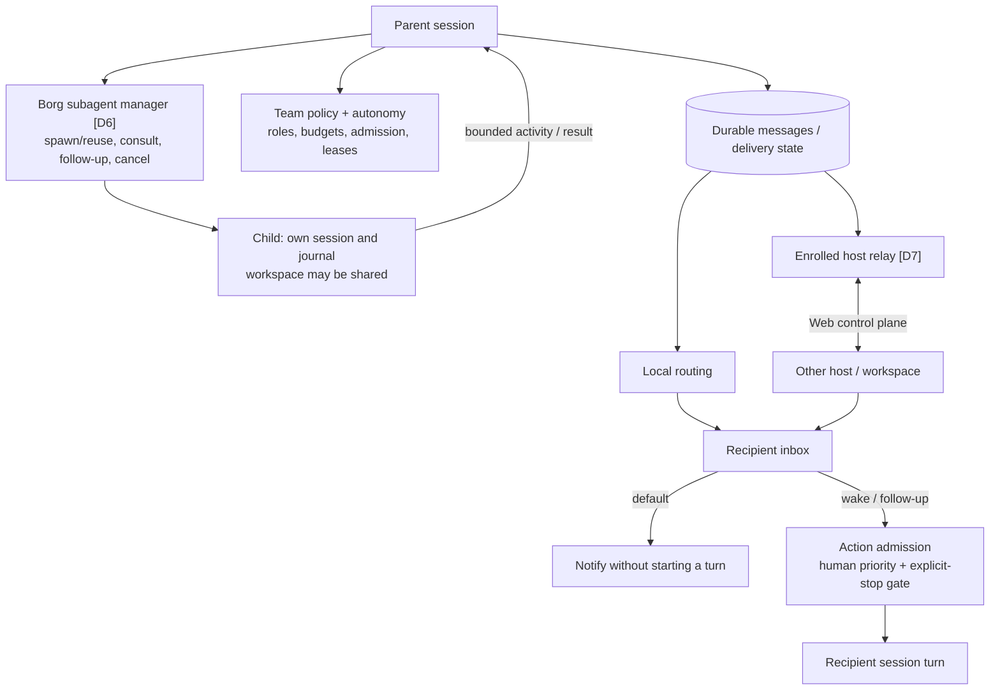

# Backend architecture — decision review map

Borg is a local-first Rust agent host. **One session actor owns execution;
SQLite owns durable truth; frontends attach as clients.** Provider-neutral
ownership is the direction, not yet the reality of every provider route.

Source baseline: `d6b19e2` (v0.8.1). This is one diagram-led reference page,
not a target design. Arrows show runtime flow, not all Cargo dependencies.
**D1–D8** identify choices to challenge in the review table below.

## 1. Components and process boundaries

These are modules, not microservices. `borg-ui` shares presentation logic, but
UI/CLI code still depends on provider/remote types. `borg-remote` re-exports
runtime APIs; the protocol is not yet a dependency-neutral crate. Headless and
ephemeral execution need not detach.

**Source:** [workspace](../Cargo.toml), [CLI](../crates/borg-cli/src/main.rs),
[local control](../crates/borg-agent-runtime/src/local_control.rs),
[executor](../crates/borg-agent-runtime/src/agent.rs),
[remote host](../crates/borg-remote/src/host.rs), [core](../crates/borg-core/src/model.rs).

## 2. Turn execution — the ownership split

**D2:** Kimi, GLM, OpenRouter and OpenAI-compatible use `NativeHarness`.
Codex can use it via model-only/session routing. Other Codex, Claude and
OpenCode turns use `run_borg_provider_turn`; Codex/Claude warm pools retain
subscription continuity. The compatibility route still delegates inner-loop
behavior upstream. Borg manages outer-session recovery and usage-limit waits;
there is no automatic subscription-to-API billing fallback. Continuation is
account-scoped, not the authority for session identity.

**Source:** `LocalAgentTurnExecutor::execute` in [agent.rs](../crates/borg-agent-runtime/src/agent.rs),
`run_bound` / `execute_tool` in [native_harness.rs](../crates/borg-agent-runtime/src/native_harness.rs),
`native_conversation` in [session.rs](../crates/borg-agent-runtime/src/session.rs).
[Ownership details](provider-ownership.md).

## 3. Durability, context and replay

**D3/D5:** Durable actions, leases and receipts do not make arbitrary shell or
network effects exactly-once. Inspect uncertain effects before retrying.
Compaction and search are projections, not replacement journals. Streaming
deltas and mirrored child activity are deliberately coalesced/filtered.
Session-scoped process memory is not recovered from the event log.

**Source:** `SessionEventKind::persistence` / the `SessionStore` trait and its
`SqliteSessionStore` and `PostgresSessionStore` backends in
[session_store.rs](../crates/borg-agent-runtime/src/session_store.rs)
and [postgres/](../crates/borg-agent-runtime/src/session_store/postgres/),
selected by [factory.rs](../crates/borg-agent-runtime/src/session_store/factory.rs),
[action transitions](../crates/borg-agent-runtime/src/session_action.rs),
[writer lease](../crates/borg-agent-runtime/src/session_lock.rs),
[jobs/checkpoints](../crates/borg-agent-runtime/src/autonomy.rs),
[receipts](../crates/borg-agent-runtime/src/receipt.rs).
[Lifecycle](session-lifecycle.md).

## 4. Collaboration and remote delivery

Discovery is not liveness or delivery acknowledgment. Notification, delivery and
wake are separate operations. Remote messaging needs no shared project.
A child session is not filesystem isolation; ACP is an interoperability adapter,
not an alternative authority for Borg orchestration.

**Source:** [subagents](../crates/borg-agent-runtime/src/subagents.rs),
[team policy](../crates/borg-agent-runtime/src/orchestration.rs),
[workspace messaging](../crates/borg-agent-runtime/src/workspace.rs),
[relay](../crates/borg-remote/src/host.rs), [ACP](../crates/borg-cli/src/acp.rs).
[Multiplayer details](multiplayer-workspaces.md).

## Feature index — where to change behavior

| Capability | Owner / boundary |
|---|---|
| Shell, files, process control | [execution](../crates/borg-agent-runtime/src/execution.rs), [processes](../crates/borg-agent-runtime/src/native_process.rs), [filesystem](../crates/borg-agent-runtime/src/filesystem.rs). Native default: shell-first `exec`, with `borg tools` / `borg call` discovery. |
| LSP, MCP, skills and instructions | [LSP](../crates/borg-agent-runtime/src/lsp.rs), [external MCP](../crates/borg-agent-runtime/src/native_mcp.rs), [context](../crates/borg-agent-runtime/src/native_context.rs), [CLI MCP bridge](../crates/borg-cli/src/agent_mcp.rs). |
| Extensions and code workflows | [Loader/policy](../crates/borg-cli/src/extensions.rs), [extension API](../crates/borg-agent-runtime/src/extension_api.rs), [Blu/workflows](../crates/borg-agent-runtime/src/blu_workflow.rs), [persistent workers](../crates/borg-agent-runtime/src/persistent_runtime.rs). Embedded Blu/Lua/Luau and supervised external runtimes have different lifetimes. [Contract](blu-extensions.md). |
| Desktop | [Computer use](../crates/borg-agent-runtime/src/computer_use.rs) dispatches Linux Python, macOS Swift and Windows PowerShell helpers. Scoped observation, permissions and consequential-action confirmation. [Readiness](computer-use.md). |
| Search, local models, dictation | [Search](../crates/borg-search/src/lib.rs): bounded/federated Exa, Firecrawl, Parallel, Brave. [Local models](../crates/borg-provider/src/local/mod.rs): discovery/fit, not inference. [Dictation](../crates/borg-dictation/src/lib.rs): managed local transcription / configured endpoint. |
| Goals, plans, history, import, fork/revert | [Session tools](../crates/borg-agent-runtime/src/session.rs), [store](../crates/borg-agent-runtime/src/session_store.rs), [importer](../crates/borg-cli/src/importer.rs), [imported memory](../crates/borg-agent-runtime/src/imported_memory.rs), [opt-in bounded snapshots](../crates/borg-agent-runtime/src/workspace_snapshot.rs). Transcript fork is not full filesystem rollback. |
| Background work and observability | [Watchers](../crates/borg-agent-runtime/src/watch.rs): session-scoped processes; [autonomy](../crates/borg-agent-runtime/src/autonomy.rs): durable jobs/leases; [profiling](../crates/borg-agent-runtime/src/profiling.rs): optional; [usage](../crates/borg-agent-runtime/src/provider_usage.rs): provider admission visibility. |
| Configuration, auth, distribution | [Config](../crates/borg-cli/src/agent_config.rs), [credentials](../crates/borg-provider/src/credentials.rs), [auth](../crates/borg-provider/src/provider_auth.rs), [updater](../crates/borg-cli/src/updater.rs). Secrets, session identity and executable lifecycle are separate concerns. |

## Engineering decisions to challenge

Questions below are review prompts, not confirmed defects.

| ID | Current choice → tradeoff | Question |
|---|---|---|
| **D1** | Detached single-writer host → continuity, but leases/sockets/stale-owner recovery. | Is per-session process overhead justified? |
| **D2** | Native + upstream compatibility loops → subscription UX, but duplicated control/context paths. | Which upstream responsibilities are truly required? Preserve login, continuation, cancellation and usage when migrating. |
| **D3** | Journal + live/search projections → local recovery, but contention/migrations/projection correctness. SQLite is the default; PostgreSQL removes the machine-wide write lock. | Which events must remain lossless? Which backend does this deployment need? [Backends](session-store-backends.md). |
| **D4** | Full Access / Auto reviewer / Manual → permission gates, **not a sandbox**. | Is trusted-user authority appropriate for this deployment? |
| **D5** | Durable jobs/actions + non-durable OS effects → recoverable intent, not universal exactly-once execution. | Which interrupted effects require reconciliation? |
| **D6** | Separate child journals, potentially shared workspace → cheap collaboration, possible write conflicts. | Where are worktrees or stronger isolation needed? |
| **D7** | Web policy + host execution → trust crosses machines. Trusted-user differs from attested isolated-hosted. | Which hosts may receive untrusted work? [Isolation contract](agent-runtime-protocol-v1.md), [operations](remote-unattended-runbook.md). |
| **D8** | User-capped extensions, hash-pinned native C ABI in-process; large runtime modules and cross-layer types remain. | Should native code share the crash/security boundary? Which stable contracts should be extracted first? |

When revising a decision, check the linked implementation and **both** turn
routes. Intended ownership in design docs is not proof of current ownership.
