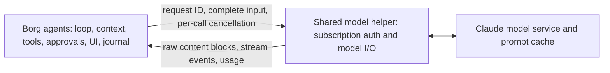

# Claude shared model connector: a working ownership boundary

2026-09-24. Implemented and activated in the local agent executor. Claude turns
and children now use Borg's native harness through one shared subscription model
helper per persistent credential authority. No Claude agent loop runs on this
path. The historical prototype measurements below are labeled separately.

## Implementation verification

The [subscription model provider](../crates/borg-provider/src/provider/claude_model.rs)
now uses a [host broker](../crates/borg-provider/src/provider/claude_connector.rs)
and [model-only preload](../crates/borg-provider/src/provider/claude_connector.js).
The broker validates the official **2.1.281** binary checksum, coordinates startup
across Borg processes, and protects its local transport with a private random
credential. The helper inherits the startup lock and publishes its own endpoint,
so a launcher exit cannot release ownership during startup. It selects a persistent credential authority independently of the
conversation, verifies the actual OAuth account, bounds requests and streams,
and supports addressed cancellation and disconnect cleanup. The helper retires
after five idle minutes and survives the Borg process that launched it.

The provider uses native model capabilities, preserves account-bound content
blocks, and publishes raw per-request usage snapshots with an explicit completion
flag. Borg still constructs every message, tool schema, cache breakpoint and
thinking/output setting. The helper invokes no agent loop or tool executor.

Fresh live checks with the checked-in
[probe](../crates/borg-provider/examples/claude_model_probe.rs), using the existing
subscription and Sonnet 5:

| Check | Measured result |
| --- | --- |
| Four independent Rust clients, eight model calls | One helper PID; first request windows overlapped; all tool continuations passed |
| Cold input across four conversations | 79,892 cache-write tokens, 8 other input tokens, no cache reads |
| Warm tool continuations | 79,892 cache reads, 245 writes, 8 other input tokens: **99.68%** cached |
| Helper peak sampled memory | 122.96 MiB RSS, **119.39 MiB PSS**; excludes Rust clients |
| Client process exit | Helper remained alive after all four clients exited |
| Host lock after launcher exit | Still held by the helper; another process could not acquire it |
| Rust future cancellation | Selected stream cancelled after text began; active peer completed; helper reported zero remaining requests |
| Forced helper death and new-client recovery | New helper PID; signed thinking replay passed; 20,149 cache reads, 222 writes, 2 other input tokens |

Recovery used a serialized Borg `ModelMessage` checkpoint and a 728-byte thinking
signature. Its server cache was still warm; this does not test expiry. The
concurrency run took 9.54 seconds including client startup/checksum validation.
Memory was sampled every 40 ms. These small tests neither measure subscription
allowance debits nor establish native-Claude memory parity at large contexts.

The live probe found a valid empty tool-input delta that the initial decoder
rejected. The decoder now retains the initial `{}` input, with a regression test.
The cancellation probe also caught an absent tool list being serialized as null;
that request-construction bug was corrected before repeating the successful test.
Other stream tests cover signed/opaque state through serialization and rejection
of truncated or corrupt responses; account-isolation tests reject continuation
from a different or unknown subscription.

The current runtime binding admits Linux x86-64 glibc only and fails explicitly
elsewhere. It never falls back to API billing or a provider-owned agent loop.
Evidence for these provider checks is retained locally in
`~/.local/share/borg/assessments/2026-09-24-subscriptions/claude-connector-research/rust-provider-proof/`.

### Full Borg runtime verification

The checked-in [session probe](../crates/borg-remote/examples/codex_native_probe.rs)
ran against an isolated PostgreSQL journal using the existing subscription:

- A real Borg `exec` call passed manual approval, then Borg-owned compaction,
  durable session restart, and an isolated consultation. Native content was
  journaled; no Claude-owned session ID was created.
- The same sequence passed with automatic approval, including Claude's
  structured JSON review. Approval and consultation requests also retain raw
  request/usage audit events.
- Two Borg children streamed concurrently through one helper. Steering the
  first and interrupting the second acted independently. Both recovered their
  own private marker on follow-up, including the interrupted child. Each child
  had its own journal, usage, request identity and actual parent identity.
  Their parent received the normal `SubagentActivity` events used by Borg's UI;
  this check did not render a UI.
- Sampled combined peak memory for the two-child test was **166.44 MiB PSS**:
  Borg separately peaked at 62.64 MiB and the helper at 103.82 MiB. These
  separate peaks need not coincide. Sampling was every 50 ms; the workload
  took 16.99 seconds. PostgreSQL, a rendered UI and unrelated host services are
  excluded. This is a small-context measurement, not a memory scaling limit.

The live tool check found Claude rejects top-level `oneOf` in tool schemas.
The exec declaration now states the exclusive choice directly; Borg's existing
runtime validation still requires exactly one of `cmd` and `session_id`.

The control probe passed immediate durable queuing while a command is running,
delivery at the tool boundary, and interruption that reaps the command. Its
earlier expectation of a completed steer before the command ended was obsolete:
completion now means the steer was durably folded into model input.

Evidence: `claude-connector-research/runtime-cutover-proof/` under the same
assessment directory. Logs include unsuccessful trials as well as final passes.

### Persistent login authorities

Local use continues to read the normal Claude Code login directory. Embedding
controllers must initialize and retain a private directory per selected login,
then supply `ChatProviderAuth.claude_config_dir` (or `codex_home` for Codex).
Turns never restore an old bundle over rotating credentials. Missing directories,
provider mismatches and cloud-channel substitutions fail explicitly. A controller
using only the old bundle field must adopt this persistent-directory contract.

Normal turns, approvals, compaction and consultations bind the selected account.
Replayed native state is checked against that account before sending it. Native
refresh uses the runtime's own credential invalidation, refresh lock and 401
recovery. Credential-boundary tests cover persistence, isolation, stale-bundle
avoidance and redacted diagnostics. A real expired-token race was not forced.

## Recommendation

Make the first cutover transfer the complete agent runtime to Borg. Retain one
shared Claude model helper per credential authority, serving independently
addressed inference calls. Borg owns children, messages, the loop, context and
cache policy, tools, permissions, journal, UI, steering, cancellation decisions,
and recovery from the first release of this path.

**The original prototype established the boundary.** Four overlapping, isolated
conversations ran through one unmodified Claude Code binary without starting
Claude's agent loop. The helper peaked at 148.47 MiB PSS. Warm follow-ups reused
99.60% of input tokens from cache. A new helper process recovered a conversation
from caller-supplied messages and reused its cache.

The earlier audit correctly identified limitations of stream-json's public
controls, but its process-per-conversation recommendation was too conservative
as an architectural conclusion. An internal model-call boundary provides another
route. It does not require Claude's native Agent tool, native child sessions,
or a presentation layer over Claude-managed children.

The subsequent implementation and full-runtime checks above establish Borg
integration. They do not establish a supported public interface or the absolute
minimum possible transport footprint.

## What was inspected

- The read-only local extraction of Claude Code **2.1.278**, particularly
  [native child execution](/home/shulgin/claude-extract/readable/0457.js:3136),
  [context cloning](/home/shulgin/claude-extract/readable/0311.js:67079),
  [client creation](/home/shulgin/claude-extract/readable/0311.js:37346), and
  [model-only completion](/home/shulgin/claude-extract/readable/0311.js:62035).
- The online TypeScript source mirror, pinned at
  `3da94d5e5f2b99c9d82b0d8f09448b04775cd41f`:
  [runAgent.ts](https://github.com/willin/claude-code-source-code/blob/3da94d5e5f2b99c9d82b0d8f09448b04775cd41f/src/tools/AgentTool/runAgent.ts),
  [forkSubagent.ts](https://github.com/willin/claude-code-source-code/blob/3da94d5e5f2b99c9d82b0d8f09448b04775cd41f/src/tools/AgentTool/forkSubagent.ts),
  [client.ts](https://github.com/willin/claude-code-source-code/blob/3da94d5e5f2b99c9d82b0d8f09448b04775cd41f/src/services/api/client.ts),
  and the request/authentication code. This older source was a navigation aid;
  its implementation was neither executed nor copied into Borg.
- Borg's current Claude adapter, native harness, model-state contract, auth
  restoration, Anthropic encoder/decoder, and host idle-process registry.

Claude's native children use separate messages, context objects and abort
controllers while sharing host infrastructure. That memory arrangement does
not depend on Claude owning the child lifecycle. The important primitive for
Borg is independent inference with complete caller-owned input and output.

The extraction also exposes plugin `model.complete` and `model.fork` operations.
Their wrappers restrict input/output or tool use; those wrappers are insufficient
for a general Borg model transport. The lower client boundary is sufficient for
the tested workload.

## How the original prototype worked

The unmodified 2.1.278 binary honors a process-local `BUN_OPTIONS=--preload=...`.
The research preload imports three embedded modules, initializes the existing
configuration/authentication machinery, and serves a small JSON-lines protocol.
It exits before the normal CLI entrypoint executes.

The relevant private functions are `wje` for configuration initialization,
`VW` for the authenticated model client, and `XEn` for the native request
attribution envelope. The wrapper identifies its client application as
`borg-connector-research`, requires subscription OAuth, and rejects API keys.
It sends model requests with the caller's messages and tools, then forwards raw
stream events. Each in-flight call has its own abort controller.

The helper retains only authentication/configuration caches, transport state,
and active requests. The test driver retains conversation history, executes the
synthetic tool, assembles native response blocks, and writes the recovery
checkpoint. No Claude `runQuery`, Agent tool, MCP tool loop, compaction routine,
or native transcript is used.

This is a private-module integration. The exact bindings failed on **2.1.280**
before inference because module paths had changed. Binary/version validation
and fail-closed startup are therefore requirements, not optional polish.

### Why ordinary OAuth HTTP was not enough to prove the route

Minimal direct HTTP requests returned generic HTTP 429 while ordinary Claude
Code succeeded. A local forwarding probe verified that both used the same
OAuth credential, and that the successful request contained no API key.
Forwarding the CLI-built request through Python succeeded. Replaying that
request with a Borg user-agent also succeeded; a minimal Borg body with the
same metadata still returned 429.

These observations rule out a requirement that inference remain inside the
CLI's original network connection. They do not isolate every required envelope
field or prove that the 429 was ordinary account exhaustion. The working helper
uses the runtime's own request machinery instead of depending on an incomplete
reimplementation of that envelope.

The research wrapper passed a fixed attribution fingerprint to `XEn`. Acceptance
of that probe is not complete attribution conformance. The production connector
must preserve the selected runtime's attribution behavior, model capabilities,
and effective request settings explicitly.

## Original prototype measurements (2.1.278)

Linux x86-64, unmodified Claude Code 2.1.278, `claude-sonnet-5`, existing Max
subscription OAuth. A unique synthetic system prefix made the first group cold
in the server cache. Four first requests overlapped; four follow-ups overlapped.
All four histories recovered their own distinct private test code.

| Workload | Calls | Cache-read input | New cache writes | Uncached, non-write input | Output | Thinking, included in output |
| --- | ---: | ---: | ---: | ---: | ---: | ---: |
| Cold conversations | 4 | 0 | 25,754 | 8 | 24 | 0 |
| Warm follow-ups | 4 | 25,754 | 96 | 8 | 78 | 0 |
| Caller-created fork | 1 | 6,464 | 31 | 2 | 21 | 0 |
| Tool request | 1 | 0 | 6,969 | 18 | 33 | 0 |
| Tool-result continuation | 1 | 6,767 | 162 | 2 | 18 | 0 |
| Reasoning request | 1 | 0 | 6,455 | 2 | 1,221 | 449 |
| Signed reasoning replay | 1 | 6,455 | 1,243 | 2 | 15 | 0 |
| New helper, restored conversation | 1 | 6,464 | 36 | 2 | 21 | 0 |

Definitions are Anthropic's response counters: total input is cache reads plus
cache writes plus `input_tokens`. All reported writes here used the one-hour
cache. Output includes thinking; adding the thinking column again would double
count it. Changing tools or thinking mode changed some prefixes as expected.

Warm cache fraction was `25,754 / (25,754 + 96 + 8) = 99.60%`. Recovery after
process restart read `6,464 / (6,464 + 36 + 2) = 99.42%`. The latter was a cold
**process** with a warm **server cache**, within its TTL. It is not evidence of
cache persistence beyond expiry.

The four cold calls took 2.77 seconds from first start to final completion;
the four warm calls took 2.71 seconds. These are single synthetic samples,
not latency percentiles or coding-task benchmarks.

### Memory

| Helper state | RSS | PSS |
| --- | ---: | ---: |
| Initialized, idle | 142.78 MiB | 140.22 MiB |
| Peak sampled with four requests active | 151.93 MiB | 148.47 MiB |

PSS grew **8.25 MiB** above the initialized helper in this workload. Sampling
was every 40 ms and can miss shorter peaks. These figures exclude the Python
driver/Borg process and are not a long-context scaling estimate. No matched
native-Claude-child memory benchmark was run. They establish that four
caller-owned conversations do not require four full Claude runtimes.

### Ownership and failure checks

- Cancellation after the first streamed text stopped only the selected call;
  a peer was still active at cancellation and completed normally.
- The driver received a raw `tool_use`, supplied its own tool result, and
  successfully continued the model. The helper executed no tool.
- The response contained a signed thinking block. Its 1,304-byte signature and
  content were preserved in replay; the next request succeeded.
- A caller-created fork reused the supplied parent history and cache under a
  different identity without creating a Claude child.
- A different helper PID restored the saved history and returned the correct
  private code. The helper had no conversation checkpoint of its own.
- Missing subscription credentials, an API-key override, and an unsupported
  binary all exited before inference. None fell back to another agent loop.

The first cancellation trial exposed a prototype bug: the SDK iterator can end
normally after abort. Checking only for an exception wrongly reported success.
The wrapper now checks the abort signal before emitting its terminal event;
the repeated cancellation check passed. Usage received before abort remains
partial and must not be presented as a final billed total.

## Implemented ownership boundary

These responsibilities move together in the native execution path:

1. **Host-owned shared helper.** Broker calls by account/credential authority,
   not by Borg child, worktree, or temporary auth-home path. Coordinate across
   Borg processes; an in-process singleton alone is insufficient. Use a local
   authenticated/private transport, per-call cancellation, bounded framing and
   backpressure, disconnect cleanup, and one helper restart authority.
2. **Borg's native harness for Claude.** Route normal turns, subagents, steering,
   tool rounds, approvals and compaction through the existing Borg machinery.
   The helper accepts model calls only. A tool request ends that model call;
   Borg decides and executes the next action.
3. **Lossless durable model state.** Persist ordered native content, signatures,
   redacted thinking and tool IDs, with the originating account and protocol.
   Resume and fork from that state. Never reconstruct a tool round from rendered
   text or discard a signed block that continuation needs.
4. **Borg-owned request and cache policy.** Keep instructions and schemas stable,
   preserve order, record effective model/effort/beta/cache settings, and own
   breakpoint placement and context changes. Use current model capabilities for
   context/output limits, thinking, images, structured output and fast mode.
5. **Subscription login, recovery and usage.** Keep the existing login flow;
   reuse the native credential refresh/locking machinery in the shared
   authority. Validate refresh races and account switching. Preserve raw usage,
   reasoning subsets, cache TTL breakdown and partial-usage status in journals
   and UI. Label API-price equivalents separately from actual plan consumption.
6. **Atomic activation.** Validate the pinned binary and the complete Borg path
   before selecting it. An incompatible helper produces an actionable error.
   Recovery replays Borg state and never silently chooses API-key billing or
   restarts a provider-owned agent loop.

### Source locations

- [Executor routing](../crates/borg-agent-runtime/src/agent.rs):
  `LocalAgentTurnExecutor::uses_native_harness` and `execute`.
- [Account binding, model dispatch and compaction](../crates/borg-agent-runtime/src/native_harness.rs):
  `with_provider_context`, `with_model_access_for`, `ProviderModelClient`, `compact`.
- [Durable replay](../crates/borg-agent-runtime/src/session.rs):
  `native_conversation_with_images` and `native_request_prefix`.
- [Lossless model state](../crates/borg-core/src/model.rs): `ModelProviderState`.
- [Native content codec](../crates/borg-provider/src/provider/anthropic_messages.rs).
- [Pinned binary and shared helper](../crates/borg-provider/src/provider/claude_connector.rs).

## Remaining evidence limits

The full runtime probes used Sonnet 5 at low effort. Provider probes separately
covered signed thinking replay and helper replacement; codec tests cover images
and opaque blocks. We did not force real OAuth expiry, exhaust quota, run every
selectable model/fast-mode combination, visually inspect the UI, or establish
production-sized memory scaling. Mid-stream interruption retained partial usage;
the forced-helper-death recovery probe killed the helper between requests.
Other platforms require their own validated binary bindings before they can use
this route. These are explicit limits, not fallback routes.

The observed credential lane was subscription OAuth and no API key was used.
We did not measure an isolated change in the account's subscription allowance.
Anthropic's current [billing notice](https://support.claude.com/en/articles/15036540-use-the-claude-agent-sdk-with-your-claude-plan)
says its proposed SDK billing changes are paused and SDK/third-party usage still
draws from subscription limits. Its [SDK overview](https://code.claude.com/docs/en/agent-sdk/overview)
separately restricts offering subscription login in third-party products without
prior approval. A successful private-runtime probe does not establish vendor
support or product-distribution approval, and API-key substitution is outside
this design.

## Evidence and reproducibility

Evidence directory:
`/home/shulgin/.local/share/borg/assessments/2026-09-24-subscriptions/claude-connector-research/`.

- `shared_connector.js`: the version-bound model helper, with no agent loop.
- `shared_connector_probe.py`: concurrent caller, tool execution, cache/replay,
  cancellation and memory checks.
- `shared-connector-summary.json`: normalized successful-run results.
- `shared-connector-first-process.json` and
  `shared-connector-recovery-process.json`: raw events and memory samples.
- `shared-connector-failure-checks.json`: credential and version failures.
- `capture-auth-comparison.json` and `request-ablation-result.json`: credential
  equality and transport comparisons, with account context redacted.
- `evidence-manifest.json`: hashes of the helper, driver and principal results.

The tested binary is `/home/shulgin/.local/share/claude/versions/2.1.278`, SHA-256
`5c4735937844e84f8a93306e841a5b0e12252909b07870f789b190468da147ab`.
The extraction and installed binaries were not modified. Probe artifacts contain
synthetic conversations and model output; credentials were never recorded.

Production execution now uses this boundary. The helper has a shared runtime
cost; live request buffers and Borg histories still grow with concurrent work.
