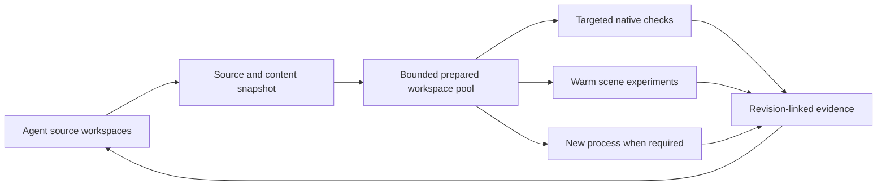

# Faster Abundance iteration

Investigation: 24 September 2026. Borg source inspected through
f25d7aa96b8609227e7a4aa146728909ec322e2f; Abundance through
9cca68d575cae88d36e72b5c4d77db204cf79f3a. Both repositories were active.
The initial investigation used source, existing evidence, read-only lane
status and aggregate journal queries. That phase performed no builds or
launches. The subsequent authorized implementation has its own
[private visual pilot and measured evidence](../../../abundance/docs/VISUAL_ITERATION.md);
the architectural recommendations below include work beyond that pilot.

**Implementation delivered, 24 September:** the authorized reliability follow-up
is on Abundance main through `fbc5fb1e`. It adds host RAM reservations and a
compiler-action cap, portable ignored/generated asset manifests with safe
reflink staging, bounded automation with conclusive final results, default
zero-test preflight, and atomic candidate/result/review/activation checks. The
private visual runner now pins its tool code as well as runtime inputs and
suppresses the one-shot capture timer that previously ended warm sessions.
The pre-existing item-purpose audit failure was fixed by scanning nested
runtime sources. Details, commands and complete evidence are in
[VISUAL_ITERATION.md](../../../abundance/docs/VISUAL_ITERATION.md).

Borg core commits `f2fb4c59`, `8d4b40a3` and `9c58e0e2` coordinate admission
across independent journals, account for remaining growth without crediting
reclaimable file cache, preserve quarantined workloads' reservations, and rotate
backend ports durably across supervisor crashes. Plugin commit `7b7d72c4`
exposes project-configured visual/asset adapters. Existing Borg job/service
ownership remains authoritative; the Abundance bridge uses the same host lock
and claim protocol. Old runtimes and raw heavy commands do not automatically
participate, so production adoption still requires the coordinated runtime
upgrade. This implementation did not select a backend or restart the shared
editor, and did not repeat real-Unreal crash recovery on the new Borg binary.

The final matched torch experiment produced three frames at 1600 × 900 with
8-second stable settle per arm. **Measured:** 31.26 s private-editor startup;
60.37 s first batch including 18.14 s PIE setup; 28.57 s repeat batch in the same
editor/PIE. Thus reuse saved 63.06 s versus editor startup plus first batch
(91.63 s), excluding build, queue and fixture checks. These are single paired
observations, not percentiles or standalone-game screenshot parity. Identical
camera/pawn/settings readbacks and visually consistent off/normal/overexposed
arms establish that the live light controls changed the rendered scene.
All 1,263 hashed source/tool inputs match the committed implementation.

Cached verification of all 23,089 Content files (50.8 GiB) took 1.32 s to
snapshot and 4.54 s to verify/stage an already complete tree. A deliberately
missing mannequin/foliage fixture staged two files (15.8 MB) in 0.036 s using
reflinks with independent inodes. These measured warm operations do not include
the unmeasured first full content-hashing cost.

Acceptance evidence: Borg unit contracts 66/66 and separate cross-process host
admission tests 2/2; plugin nine passes/two opt-in skips; Abundance release-switch
46/46, asset/watchdog/release contracts 6/6 and visual contracts 7/7. The full
339-case native run had 335 passes, three fixture skips and one fake scope test
whose RAM request made it depend on live contention. Its corrected fixture and
the reliability test both passed on rerun. Recovery-port rotation was verified
against an occupied TCP port using a fake backend; its expected avoidance of
the reported ~61-second recovery penalty is still an estimate for real UE.

The remaining architectural ideas below (a reusable workspace pool, broader
gameplay scenarios, input replay, remote workers and product packaging) are
future proposals, not claims of delivered capability. The implemented changes
target normal visual iteration and prevent invalid work first; rare recovery
speed remains a separate acceptance gate.

**Recommendation:** optimize time from an edit to a trustworthy decision about
the running game. Build a reproducible experiment runner on the existing lanes,
make frequently tuned presentation values changeable in a running scene, and
separate agents' source workspaces from a bounded pool of prepared Unreal
workspaces. These changes reinforce one another.

The important unit of work is a specific revision, complete content set, scene
state, action sequence, and resulting evidence. A build finishing, an MCP
endpoint responding, or a PNG appearing establishes only part of that contract.

**1. What the evidence says**

| Observation | Implication |
| --- | --- |
| Existing documentation records 1–3 s warm captures versus approximately 38 s cold captures. PIE startup is about 13 s. | Keep scenes warm and amortize setup. These are component timings, not a guarantee that a production-quality comparison takes 3 s. |
| The legacy editor supervisor waits for 45 s of build quiet before restarting; documented MCP downtime is approximately 46 s. | Even a 10 s incremental build can lead to roughly two minutes before feedback after restart, PIE, and scene setup. This is an illustrative sum of separate measurements, not an observed end-to-end percentile. |
| Live lane records contained 242 completed AbundanceEditor jobs in the preceding day, 214 successful. Successful jobs had median execution 36.76 s and p90 422.29 s; median queue 0.14 s and p90 367.95 s. | Typical queueing is already cheap; the tail remains severe. The sample mixes leaf edits, large changes, and tooling experiments. It is not a controlled before/after comparison. |
| Those successful jobs accumulated about 8.3 execution hours and 5.0 queued hours. | These are aggregate job hours across concurrent agents, not elapsed human waiting or a sum of independent critical paths. |
| The refreshed agent report found 53 sessions, 22,765 tool calls, 107.2 active-turn hours and 43.4 blocking-tool hours in its one-day window. | Model interactions and repeated investigation deserve attention alongside engine execution. The remainder is not a measured inference-time category; tool overlap, background work and heuristic classification limit attribution. |
| A prior four-test automation sweep measured median 70.289 s headless versus 11.224 s warm. | Reusing the editor works, but eligibility, fixtures and state reset determine how widely it can apply. |
| A clean foliage verification tree initially had 20/72 required presentation assets; after staging local content it had 69/72, matching the working tree. | Git revision alone does not reproduce the game. Missing assets can waste launches and create misleading visual results. |
| At inspection, the host had approximately 183 GiB disk free, 19 GiB available RAM, 12 GiB swap used, and 23 GiB used in the tmpfs mounted at /tmp. The warm editor reported approximately 4 GiB RSS and a recent earlyoom termination. | More simultaneous editors are not automatically faster. Tmpfs also competes for memory/swap. Protecting useful warm state can beat increasing process count. These are changing host snapshots. |

Evidence: Abundance [editor lane](../../../abundance/docs/EDITOR_MCP_LANE.md),
[build lane](../../../abundance/docs/BUILD_LANE.md),
[warm automation sweep](../../../abundance/docs/WARM_AUTOMATION_PARITY_SWEEP.md),
[foliage validation](../../../abundance/docs/FAR_CANOPY_PHASE3_VALIDATION.md),
and [agent-time reporter](../../../abundance/Scripts/agent_time_report.py).
The foliage validation's visual conclusion has since been superseded; its
recorded asset-staging failure remains relevant.
Live measurements were collected around 00:52–00:57 BST on September 24.
Current build measurements were computed from
/run/user/1000/abundance-build-lane/jobs/*/job.json, selecting completed
AbundanceEditor jobs with a finish time in the preceding 24 hours. Execution is
finished minus started; queue time is started minus created.

The user subsequently supplied the running agent's more specific measurements.
These were **reported measurements, not rerun in this investigation**:

| Workflow | Reported observation |
| --- | --- |
| Horse compilation | 376 s cold; commonly 8–50 s incremental; 130–300 s larger rebuilds; independent rider-only editor build 256 s |
| Forest review | 25 cold launches over 57 min: 22.8 min inside Unreal and 34.2 min between launches, including both queueing and investigation |
| Isolated forest view | 54–57 s total; map/world ready at 20–27 s; configured settle 8 s |
| RiderReview | World ready at 45 s; test began at 64 s and passed at 93 s; 15 screenshots batched within its 28.7 s test |
| Private editor parity | Startup 43 s, PIE 12 s, capture 4 s; render/write itself approximately 0.6 s |
| Avoidable invalid work | Wrong save/world pairing caused a 650 s crash/restart loop; two selectors matched zero tests; three stationary “moving” sweeps invalidated 72 frames |
| Visual and source provenance | Screenshots revealed a grey saddle that geometry assertions missed; repair/import/review took approximately 10 min. Forest screenshots used an earlier dirty-tree binary; final landed source was rebuilt and passed 2/2 tests but was not visually recaptured. |
| Contention | One exclusive job waited 7m58s behind a build and ran for 0.87 s; memory pressure has killed the shared editor |

The 34.2 minutes of forest inter-launch gaps cannot be classified as memory
wait or treated as wholly recoverable. The final forest visuals also remain
unverified for the landed binary until recaptured or their relevant inputs are
rigorously shown equivalent. A passing geometry/integration test cannot repair
that evidence gap.

The selected host backend was **legacy**. The newer Borg cutover is already
being developed and verified; see Abundance's
[cutover record](../../../abundance/docs/BORG_LANE_CUTOVER.md).
Older Borg migration documents do not describe all that subsequent work.
Extend that effort rather than creating a third scheduler or switching a live
tree between two admission authorities.

**Revised priorities after the second field report**

The user has authorized implementation of private warm batches and live
presentation tuning (original items 1 and 4). That work continues. The following
ranking separates prerequisites for safe normal iteration from recovery and
release-control work. New timings below were supplied by the other worker via
the user; they have not been independently benchmarked here.

| Priority / scope | Concrete change and owner | Expected saving and risk | Measurable acceptance |
| --- | --- | --- | --- |
| **1. Reserve memory across workers before dispatch. Normal iteration prerequisite.** | Borg's one admission authority reserves predicted peak RAM for builds, Cargo and private UE sessions together; wrappers submit real workloads and their budgets, rather than tiny keeper processes. Preserve reserve headroom for the shared editor. Subtract observed RSS only once, release reservations on verified process exit, and prioritize finishing an admitted build over starting another. | Prevents canceled compilation and loss of a warm editor. One prevented discarded fresh UE build can recover up to the reported 256 s of compilation, plus its retry/queue cost; partial cancellations save less. This is an estimate per avoided incident, not a per-edit saving. Overestimates reduce concurrency, so tune budgets against recorded peaks. | Concurrently request two workloads each fitting alone but not together, plus Cargo. Admit only a fitting set. Verify no oversubscription when a queued job dispatches, when actual RSS grows, and after cancellation/recovery. The reservation must cover descendants until their scope is empty. |
| **2. Reuse a private scene with an explicit asset/fixture closure. Normal iteration.** | Unreal plugin executes bounded pose × variant batches; Abundance supplies readiness and scene placement. Publish a prepared workspace's ignored/derived asset manifest with hashes and generator/import identities. Stage verified missing assets by CoW or cache reuse before UBT/launch, retain the manifest with source/modules/save/world, and require scenario-specific actors/components in the rendered scene. | Keeps the original estimated ~40–45 s saving for compatible warm arms; avoids successful builds followed by unusable visuals. The new horse result does not justify claiming the 256 s build was necessarily wasted: its binary can be reused once its fixture is repaired. Risk: an asset present on disk may still fail to load or bind. | On a clean tree, remove the mannequin and one generated foliage asset. Preflight must name both before a launch; restore only manifest-matching versions, then assert the rider mesh is loaded and visible. For three poses, verify pawn/streaming origin, actual camera and cvars, stable readiness, image completion and unchanged generation; compare representative cold and warm captures. |
| **3. Live visual values plus a bounded run/evidence protocol. Normal iteration.** | Extend FarGrass/FarCanopy's live application pattern to torch/material parameters, read back effective component values, and store overrides in each receipt. Treat queue empty as progress only. After terminal automation results, allow a bounded shutdown grace, then stop only the owned run's scope and verify it is empty. Publish completed results only after expected tests/frames and final assertions are durably written; zero tests, timeouts and missing assertions cannot pass. | Live tuning avoids the original estimated 8–50 s leaf build plus associated restart/setup when genuinely needed by each arm. An exit watchdog capped at 30 s after terminal evidence would have reclaimed roughly 5½ minutes of the reported >6 min orphan, and roughly 4 GiB while it lingered; freeing RAM is not itself a measured critical-path saving. Risks: premature timeout and stopping UE before image/report flush. | Exercise a no-op setter, omitted cvar in the next variant, failure during capture, zero selected tests, corrupt PNG, final assertion failure, and a fake editor that declares queue empty then remains alive. Restore baseline or invalidate the session; keep incomplete evidence explicitly inconclusive. Verify no unrelated process is signaled. |
| **4. Event-driven recovery with backend port rotation. Rare recovery path.** | Reuse Borg's supervisor/lease state transitions. Select an unused alternate backend port and require a successful bind/MCP identity handshake. The verdict consumer waits for the final receipt, not an intermediate watcher message or an assumed startup duration. No fixed extra quiet delay once prerequisites are satisfied. | The specific quarantine cleared in ~2 s; approximately 61 s was TCP TIME_WAIT and MCP readiness arrived 93 s after the kill. Rotation could recover about a minute per such incident, not on every ordinary frame. The interrupted verification remains **inconclusive** because its final assertions were not written. Race risk: a probed free port can be taken before bind, so bind failure needs a bounded fresh-port attempt. | Bounded fault test: kill only an owned supervisor, observe lease release, occupied/TIME_WAIT old port, fresh backend bind and generation-correct MCP readiness, then execute final capture/assertions and atomically publish the result. Retain timings for recovery, port wait and startup separately. A watcher ending early produces an inconclusive record, never a pass/fail verdict. |
| **5. Atomic release evidence gate. Release path.** | Store distinct states for candidate pinned, scripted suite passed, real-Unreal parity passed, reviewed, and activated. Bind each receipt to source SHA, CLI SHA256, suite identity, fixtures, expected counts and final assertions. A single compare-and-swap transition may mark a pin reviewed or activate it only when all required evidence for that exact candidate is complete and passing. Messages are pointers to evidence, not gate inputs. | A clean pinned Borg release build took 5m27s and its full private suite ~5½–7 min. Fixture-based negative tests avoid a spurious 5½–7 min rerun of that suite; no normal-frame saving is claimed. The three original failures were harness drift, not product failures. Risks: making all developer tests require rare recovery suites, or trusting stale receipts after a pin moves. Keep those requirements at release boundaries. | Two workers race pin/review/activation while parity is running or inconclusive: neither reviewed nor active may advance. Inject final failure, stale binary hash and missing assertions; all must block. With exact passing receipts, permit one atomic transition. Negative tests supply explicit reviewed/unreviewed fixtures independent of the repository's current pin. The host's continued legacy selection is recorded separately from the pin's review flag. |

Savings in this table overlap and must not be added. Warm capture and live
parameters remain the repeated-loop optimizations being implemented first;
reservations and asset closure decide whether concurrency produces useful work.
Port recovery and atomic release gating protect less frequent but expensive
paths. There is still no basis for assigning all inter-launch investigation
time to memory waits.

**2. Existing pieces to build on**

| Layer | Already available | What the next layer must add |
| --- | --- | --- |
| Borg execution | Shell/code execution, file edits, LSP, history, watchers, collaboration, shared-work records, durable workflows and receipts | One experiment submission and one useful completion, with an artifact manifest and stage timings |
| Borg lanes | Resource keys, atomic admission, job fingerprints, RAM/disk reservations, scopes, cancellation/recovery and supervised services | Prepared-workspace allocation, revision-aware readiness, resource-aware experiment routing and GPU policy |
| Borg computer use | GPU-backed private display, isolated input, held keys, relative mouse motion, screenshots, display sharing and image transport | Bounded action sequences, concurrent capture, frame/time metadata and compact replay evidence |
| Unreal Blu extension | Project/engine discovery, job/service templates, UBT policy, editor helpers | A usable experiment API with structured inputs and engine-specific readiness/reset logic |
| Abundance | Portable C++ core, targeted CMake tests, ccache/UBA/Zen, fixed-path builds, cached worlds, warm editor, captures, test preflight and fixture checks | Reusable scenarios, complete content identity, live tuning, gameplay observability and scene restoration |

Relevant source: [tool dispatcher](../../crates/borg-agent-runtime/src/subagents.rs),
[native tools](../../crates/borg-agent-runtime/src/native_harness.rs),
[lane bridge](../../crates/borg-agent-runtime/src/lane_tools.rs),
[receipts](../../crates/borg-agent-runtime/src/receipt.rs),
[lanes](../../crates/borg-lanes/src/lanes.rs),
[services](../../crates/borg-lanes/src/services.rs),
[private display](../../crates/borg-agent-runtime/src/computer_use/linux/private.rs),
and [Unreal extension](../../extensions/unreal/README.md).

The Unreal extension's registered workflow currently runs discovery.
Its CLI has more capabilities, but raw MCP and exclusive-operation exposure
are deliberately limited. Installing the extension does not yet provide the
complete workflow described here. Computer-use verification documents
GPU/input checks with SDL, GTK and Vulkan examples; it does not prove this
Abundance workflow has been exercised end to end on the private display.

**3. Make rendered comparisons a single operation**

Introduce an experiment request describing:

- An immutable source revision, including any explicitly captured uncommitted
  files; engine/toolchain identity; built module identities; and a content manifest.
- A scenario: world cache and save hashes, player state and pose, camera/FOV,
  time/weather, viewport size, rendering settings, and required actors/assets.
- A bounded set of variants or an input/camera sequence, plus the question being
  investigated and the regions or events that matter.
- Required evidence: stills, a short motion sequence, gameplay observations,
  performance sample, or fresh-process persistence check.

The runner resolves the cheapest valid execution route, prepares the scene,
executes the experiment, restores or discards its state, and publishes one
result. Suggested stages are input validation, queue, build, process readiness,
scenario readiness, render readiness, capture, comparison, and evidence delivery.
Each stage has its own duration, identity and failure reason.

Return actual image attachments alongside a small structured report: requested
and observed revision, test counts and outcomes, scene settings, captures,
measured motion, differences, timing summaries, and unresolved conditions.
Reuse Borg's existing image channel and artifact references. Full logs remain
available on demand. Do not spend a model turn to translate every intermediate
file path or ordinary progress line.

There are several concrete correctness gaps to close first:

- **Loaded revision.** The warm lane reports PID, PIE, lease and cvars, but
  does not report the compiled identity of its loaded modules. File mtimes or
  today's Git HEAD cannot establish what an already-running process loaded.
  Build a manifest when publishing outputs and have the process attest its
  loaded generation. Refuse a new-revision request against an old generation.
  Bind this to immutable outputs and actual loaded module identities; an
  echoed command-line label is insufficient. Avoid a globally included build-ID
  header that would itself force every translation unit to rebuild.
- **Pawn versus camera.** The lane's set_pie_view moves a detached CameraActor.
  Abundance's near-field foliage updates around the player pawn. A distant
  camera can therefore see the wrong near-field population. A scene recipe
  must place the pawn/streaming origin appropriately, await population, then
  position the view. A diagnostic free camera can remain a separate mode.
- **Readiness parity.** The cold capture path already waits for shader/assets,
  far-field cover, ecology refresh and impostors. The warm client uses an
  optional sleep and waits for a stable-sized PNG. Factor the existing
  game readiness checks into an operation both paths can use. Add the
  renderer-specific history/streaming conditions the experiment requires;
  one generic “stable pixels” threshold will fail on wind and animation.
- **Capture semantics.** Warm capture invokes HighResShot; the cold path uses
  FScreenshotRequest. Establish parity at the actual viewport resolution,
  exposure, screen percentage and temporal settings before comparing their
  pixels. Prefer a capture-completion callback associated with request ID,
  rendered frame and generation over file existence alone.
- **Sequence timing.** A recent foliage report says three intended moving
  series stayed at one camera position because route timing differed.
  Start the route after readiness, bind sampling to that run, record actual
  camera/pawn transforms, and reject a motion experiment that never moved.

Source: [warm capture client](../../../abundance/Scripts/editor_lane/lane_mcp.py),
[editor tools](../../../abundance/Scripts/editor_lane/python/ab_editor_lane_tools.py),
[cold capture readiness](../../../abundance/Source/Abundance/Private/ABRuntimeTerrain.cpp),
[foliage streaming](../../../abundance/Source/Abundance/Private/ABWorldPresentation.cpp),
and [motion evidence](../../../abundance/docs/FAR_FIELD_FOLIAGE.md).

Reset deserves an explicit contract too. Restoring cvars alone does not restore
the pawn, camera, clock, input state, authority mutations, async work or cached
presentation. Use a disposable scenario world/save, restore only state whose
reset is proven, and restart PIE or the process when it is not. Run compatible
variants within that boundary and release the worker only after successful
reset. A warm but contaminated scene can cost more than a deliberate restart.

Use two forms of visual evaluation. Controlled comparisons isolate a change
with matched conditions and appropriate temporal tolerances. Ordinary gameplay
captures retain the actual shipping-intended rendering and input behavior.
Neither replaces the other. A pixel difference detects change, not artistic
improvement; a model or human must still inspect the relevant rendered result.
For a specific rendering hypothesis, request a relevant diagnostic buffer,
visibility/asset observation or selected-object report alongside the lit frame.
Distinguishing missing geometry from material, lighting or streaming errors
can eliminate several speculative edits. Do not collect every buffer by default.
Performance comparisons need repeated, alternating samples without competing
GPU workloads, and capture overhead must be separated from frame cost.
Epic already provides [screenshot comparison facilities](https://dev.epicgames.com/documentation/en-us/unreal-engine/screenshot-comparison-tool-in-unreal-engine);
reuse them where appropriate rather than implementing another generic diff tool.

**4. Remove builds from visual tuning where possible**

Abundance already demonstrates the right mechanism:
[ABFarFieldCover.cpp](../../../abundance/Source/Abundance/Private/ABFarFieldCover.cpp)
reads runtime cvars and applies changed material parameters. Extend this pattern
selectively to frequently edited light properties, material parameters, camera
behavior and presentation settings. The same production component should consume
the values; avoid a preview-only implementation.

Some headlamp experiments instead live behind process-start flags in
[ABCharacter.cpp](../../../abundance/Source/Abundance/Private/ABCharacter.cpp).
That makes changing an experimental arm require scene/process reconstruction.
Expose a narrow runtime tuning operation that applies a complete parameter set,
performs any necessary component/render-state rebuild once, and reports the
effective values. Classify each parameter as live, component-rebuild,
scene-reload, shader-compile, or process-restart; a setter accepting a value
does not prove the renderer used it.

For compatible parameters, run one baseline and a small set of variants in
one prepared scene. Produce a contact sheet and selected full-resolution crops.
Stop once the hypothesis is answered; do not automatically expand into dozens
of captures. Commit the selected values to their normal configuration/source
and confirm them once through the ordinary startup path.

This changes the shape of a tuning session: one initial build/setup followed
by several real rendered experiments, rather than one build/setup per arm.
For the reported forest case, an initial estimate is approximately 12–15 s
per compatible warm pose, retaining its 8 s settle and approximately 4 s
capture. A new A/B pair pays for both capture cycles; later variants can
reuse a baseline only while its scene conditions remain comparable. This
is a proposed target, not a measured capability. Shorten settling only after
the readiness checks establish equivalent quality; shader/geometry changes
may require much more work.

C++ implementation and reflected-layout changes still need a valid reload
strategy. The installed UE 5.8.2 UBT defaults Live Coding to Win64/x64;
this Linux workflow should not depend on enabling Windows-style Live Coding.
Even on supported platforms, constructor defaults and object reinstancing have
limitations documented by [Epic](https://dev.epicgames.com/documentation/en-us/unreal-engine/using-live-coding-to-recompile-unreal-engine-applications-at-runtime).

Make necessary restarts **demand-driven and revision-aware**. An experiment
waiting for a completed revision can bypass the background 45-second debounce
once the build is settled and leases permit. Keep debounce for unsolicited
build bursts. Coalesce restart requests by desired generation and acknowledge
requests satisfied by any successful fresh launch.

There is a specific small investigation here: the
[legacy supervisor](../../../abundance/Scripts/editor_lane.sh) records a new
module signature when launching but removes restart-request on the explicit
restart path. Its log shows “MCP ready” at 17:23:44 followed by “restarting
editor: requested” at 17:23:51 on September 23, and similar sequences earlier.
This is evidence of potential redundant restarts, not proof that every
sequence lacked a new request. Trace the request generation, then fix that
case in the current and migrating implementations.

**5. Separate source isolation from expensive Unreal workspaces**

Keep cheap, isolated source workspaces for agents, using sparse checkouts where
binary content is unnecessary for source work. Allocate heavy build outputs,
complete art sets and render processes from a small reusable pool. A worker
checks out a frozen source snapshot into an idle slot; that slot remains
exclusive until its build and every process using its outputs have finished.
Agents continue editing their own source while the submitted snapshot runs.

Start with two prepared disk slots and at most one concurrent private
experiment renderer. Count the existing shared editor's potential growth in
RAM/VRAM admission; available capacity may permit no additional renderer.
The private pilot must wait for capacity and must not stop or reconfigure the
shared editor. Integrating or replacing that service belongs to the coordinated
cutover. Pool size is independent of the number of reasoning agents.
Keep affinity to the same revision/content/scenario when that avoids setup,
with a bounded batch size so one experiment cannot monopolize the renderer.

Practical implementation:

- Seed slots from known good prepared inputs using btrfs reflinks. The host is
  btrfs, and Abundance already supports fixed-path bwrap builds: documented
  examples took approximately 52–56 s with a full warm UBA cache versus
  453–488 s clean builds. Preserve its path normalization, rpath repair and
  dependency checks. Do not repeatedly switch one slot between path policies.
- Publish a content-set manifest covering ignored imported/generated assets,
  source hashes, importer/recipe versions, engine identity and companion
  package files. Build on existing asset manifests. Preflight a scenario's
  asset closure before launching UE. Share immutable content; asset-writing
  jobs use private writable copies or overrides, then publish a new version.
- Keep Binaries, Intermediate and mutable Saved/config outputs private to a
  slot. Share native caches through their existing supported mechanisms.
  Neither hardlinks to writable outputs nor one writable build directory
  shared across branches provides isolation.
- Preserve evidence, source snapshots and asset versions needed to reproduce
  a result separately from disposable outputs. Account for shared extents and
  pinned snapshots when estimating reclaimable space. Reserve disk for Borg's
  durable state. Automated reclamation should target pool-owned artifacts
  whose lifecycle is known, not arbitrary old user worktrees.
- Publish terminal artifacts with their source, build and content identities.
  Testing a branch never requires first merging it into main. Test an
  integration candidate containing the intended patch set before promoting it.
  Reuse earlier evidence only when relevant inputs still match.

This bounds storage approximately by prepared slots plus changed source,
content deltas and retained evidence, instead of one full Unreal output set
per agent. Reflinks defer copying; they do not eliminate changed-data costs.
The pool does not remove cold boot latency for a new binary generation.

Use Borg's existing resource keys for an initial GPU execution slot and
protect warm-service memory in admission. Add measured VRAM budgeting only
after collecting usage; RAM/disk admission is not VRAM admission. Serialize
performance samples, allow native checks alongside rendering when CPU/RAM
permit, and avoid admitting a build that predictably kills the useful warm
scene. Queue policy should favor short feedback work while aging long jobs.
Cancel superseded queued experiments only when no subscriber still needs them.
Do not preempt healthy compilers merely to improve a latency chart.

There is a concrete adapter gap here. The migrating run-lock bridge's
[admission helper](../../../abundance/Scripts/lib/unreal_run_lock.py)
sets reserve_ram_bytes to zero, and its admitted job is a small keeper;
the UE workload is started by the caller. The migrating
[editor spec](../../../abundance/Scripts/editor_lane/borg_lane.py) similarly
uses a minimum available-memory threshold with zero RAM reservation.
Borg core having a reservation field does not mean these paths reserve
the game's eventual footprint. Charge each entire workload before launch
under the same authority as builds and resident services, with measured
peak estimates, future growth and host headroom. Account for already resident
usage without blindly double-counting it as unused reservation. Cgroup limits
contain failures; they do not replace admission.

The current build runner also imposes a minimum compiler parallelism even
when its memory-derived action count is lower. Revisit that floor under
shared-host pressure as part of a measured admission policy. Until the
coordinated cutover, implement any reservation improvement in the authoritative
legacy path or test it privately; do not install a competing host ledger.

**6. Make gameplay reproduction and diagnosis cheaper**

Create named scenarios for actual player workflows: a farm control interaction,
the freight loop, riding/spook recovery, a foliage route, a dark headlamp scene.
Each carries the required fixture and assets, setup/postconditions, relevant
native checks, UE context, and reset policy. Begin with the scenarios repeatedly
used today; no need for a universal scene-description language.

Use native portable tests for policy and conservation, NullRHI integration
for runtime wiring, warm rendered runs for perception, and fresh processes
for startup/save/network contracts. The existing
[headless freight workflow](../../../abundance/docs/HEADLESS_ITERATION.md)
shows why fresh-process continuation must remain a separate proof.
Expand warm automation based on demonstrated fixture/reset independence,
rather than changing the current conservative allow-list to accept everything.

The current [focused runner](../../../abundance/Scripts/run_focused_automation.sh)
already rejects an empty final report. Its source-name preflight is opt-in,
and the opt-in coverage audit is advisory. Thus “add fail-on-zero” means
closing early and alternate-path gaps, not inventing a missing final-report
check. Cache actual runtime test discovery by built generation and execution
context; require the requested set to execute and distinguish skipped/gated
tests from passed assertions. Static source scanning is an early aid, not
authoritative discovery of dynamic registrations. Reuse the
[save/world hash readers](../../../abundance/Scripts/lib/checkpoint_world_hash.sh)
to reject a mismatched pair before starting an editor; never fix the mismatch
by silently rebinding the player's save. Deterministic input failures should
not enter supervisor restart loops.

Add a narrow developer observation surface: selected actor/component,
interaction target, effective presentation settings, relevant authority state,
and why an action is unavailable. Route actual acceptance actions through
the real player input/UI and game authority. Teleporting or granting resources
may prepare a scenario, but must be recorded and cannot establish an
unassisted playthrough.

Borg computer use is valuable for that final player-facing path. Its private
display already avoids stealing the user's mouse and keyboard. A bounded
sequence operation should schedule key press/release, mouse motion and
capture in the helper while remaining cancellable, releasing held inputs
on failure, and returning observed outcomes. Current held-key/pointer operations
use wall-clock sleeps; they do not provide frame-synchronized game replay.
Use a UE-side frame/tick barrier when precise timing is required.

Record short motion clips with timestamps and input events; return a few
keyframes/contact sheets to the model and retain the clip for review. Avoid
continuous PNG export or sending every frame into model context. The current
half-second screenshot series can miss per-frame flicker; select the recording
rate for the phenomenon being tested and report dropped frames. The
compositor allocates an offscreen buffer and performs readback for a screenshot;
streaming needs a separate measured capture path, ideally using GPU encoding.
Transport optimization comes after reliable scene setup: saving milliseconds
of PNG work is secondary to avoiding another engine boot.

A particularly useful addition is **“report this moment”** in Abundance:
capture the screenshot, actual camera/pawn, world/save identity, build/content
versions, effective settings, and a bounded recent input/event trace. Produce
a reproducible scenario attached to the user's request. The foliage work had
to reconstruct a human screenshot's viewpoint approximately; this removes
that investigation from future requests. A checkpoint plus inputs is not
automatically deterministic for physics, networking or all renderer history;
record relevant external events and report unsupported replay boundaries.

Also reduce avoidable compiler fan-out where change frequency justifies it.
The existing [header work](../../../abundance/docs/CORE_HEADER_FANOUT.md)
reduced a logistics API edit from 431 to 172 translation units. Use dependency
files and edit frequency to find the next expensive boundary. Correct
clangd/UHT metadata and focused compiler checks catch cheap mistakes early.
Further module splits should follow measurements, not an architectural
rewrite of the portable core that already works.

**7. Ownership and implementation order**

| Responsibility | Owner |
| --- | --- |
| Durable jobs, events, cancellation, resource admission, workspace ownership, artifact references, process/service lifetime | Borg core |
| UE build/content identity, worker preparation, reload classification, editor/game control, render/readiness barriers, UE report parsing | Unreal Blu plugin and its UE-side bridge |
| Save/scenario semantics, gameplay readiness, live tuning of production components, action/state observability and reproduction capture | Abundance |
| Pixels, compact comparisons and experiment results delivered to the selected model | Borg's existing image/tool transport, with plugin-provided metadata |

Preserve Borg's provider/subscription boundaries. None of this requires a new
upstream agent loop, a different billing route, or another conversation store.
Start the experiment contract over Abundance's current wrappers; converge
its reusable UE parts into the plugin alongside the existing lane migration.

| Order | Concrete delivery | Acceptance evidence |
| --- | --- | --- |
| 1 | One visual recipe with stage timings, loaded revision, content preflight, correct pawn/view placement and shared readiness checks | Same current workflow produces matching or explained pixels; wrong revision/missing asset fails before expensive execution |
| 2 | Batched live tuning and a captured camera/input route; revision-aware demand restart and stale-request reconciliation | Several meaningful variants per setup, actual motion verified, no redundant restart for an already loaded generation |
| 3 | Two prepared workspace slots using existing fixed-path/cache policy | Several source branches verified with bounded disk, no mixed inputs, no main merge required, no extra OOMs |
| 4 | Fixture-aware warm gameplay scenarios and private-display acceptance sequences | Repeated runs reset correctly; warm/fresh discrepancies reported; input outcome and visual evidence agree |
| 5 | Reproduction capture, history-based result reuse, measured scheduling improvements and optional remote workers | Lower end-to-end p50/p90 and more accepted changes per machine-hour under representative contention |

Before claiming improvement, replay a fixed small workload: a foliage scalar
change, a leaf C++ presentation edit, a reflected-header edit, a generated-asset
change, and a gameplay action followed by save/reload. Include several concurrent
agents and a normal interactive workload. Measure edit-to-first-valid-frame,
edit-to-decision, queue/build/setup/readiness times, model calls, reruns,
restart count, peak resident memory/VRAM, disk growth and wrong/stale evidence.
Use the same revisions/scenarios, comparable cache state and actual quality
settings. Record warm and cold results separately.

Source-backed defects in the experiment contract warrant small behavioral
tests: stale generation rejection, request/capture association, incomplete
fixture rejection, state restoration, source isolation and lost-wakeup recovery.
They protect cross-process or evidence-validity contracts that compilation
cannot establish. Do not add tests for incidental shell strings or every
presentation-value edit. Visual parity still needs the actual rendered smoke.

For Borg specifically, a typed job/event subscription would avoid consuming
one of four command-watcher slots per wait. Expose process completion separately
from notification delivery: the current watcher can retain a terminal
notification while its delivery queue is full. Reuse durable job state and
receipts so reconnect/retry does not rerun an uncertain game action.

**8. Product opportunities**

The strongest initial product hypothesis is a **reproducible game experiment
service**: give it a branch and a scenario; receive a playable/captured result
with matched before/after evidence and provenance. An Unreal plugin plus
CLI/MCP lets existing coding agents use it. Borg supplies the same underlying
lifecycle and resource control, rather than maintaining a separate scheduler.
The benefit to sell is faster accepted changes on the hardware a team owns.

Two adjacent products could emerge from the same implementation:

- **Reproducible bug and visual-feedback capture:** the “report this moment”
  feature turns a screenshot or complaint into a prepared developer scenario.
  Useful to human teams even without autonomous coding.
- **Shared build/render workspace management:** bounded prepared workers,
  immutable content sets, caching, ownership and recovery for teams running
  many branches or agents on a few powerful machines.

Treat these as hypotheses to validate with other projects. Generic editor
control, screenshot diffing and distributed compilation already have substantial
infrastructure. Epic's [Gauntlet](https://dev.epicgames.com/documentation/en-us/unreal-engine/gauntlet-automation-framework-overview-in-unreal-engine)
can orchestrate multi-process game tests; its
[Horde services](https://dev.epicgames.com/documentation/unreal-engine/horde-in-unreal-engine)
cover build infrastructure; [Remote Control](https://dev.epicgames.com/documentation/unreal-engine/getting-started-with-remote-control-presets-in-unreal-engine)
already exposes properties/functions. The opportunity here is their reliable
composition into the edit-to-evidence loop, including state, revision and
resource ownership. It is not a claim that nobody offers related tooling.

Defer a new cloud platform, an engine fork for arbitrary Linux C++ hot reload,
GPU process checkpointing, or a general gameplay scripting rewrite. A separate
render machine may eventually isolate contention very effectively, but first
measure transfer/content-cache costs and validate the same experiment contract.
The first investment should turn one common Abundance visual task into a
repeatable, fast operation; that provides both immediate value and a credible
foundation for broader products.
